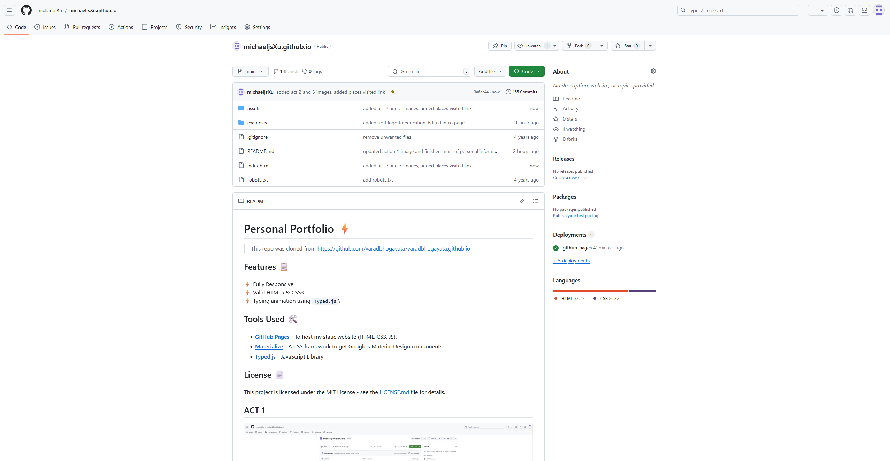

# Personal Portfolio ⚡️ 
> This repo was cloned from https://github.com/varadbhogayata/varadbhogayata.github.io

## Features 📋
⚡️ Fully Responsive\
⚡️ Valid HTML5 & CSS3\
⚡️ Typing animation using `Typed.js`\

## Tools Used 🛠️
* [<b>GitHub Pages</b>](https://create-react-app.dev/docs/deployment/#github-pages) - To host my static website (HTML, CSS, JS).
* [<b>Materialize</b>](https://materializecss.com/) - A CSS framework to get Google's Material Design components.
* [<b>Typed.js</b>](https://mattboldt.com/demos/typed-js/) - JavaScript Library

## License 📄
This project is licensed under the MIT License - see the [LICENSE.md](./LICENSE) file for details.

## ACT 1

## ACT 2

## ACT 3

## ACT 4

## ACT 5
Work in progress
